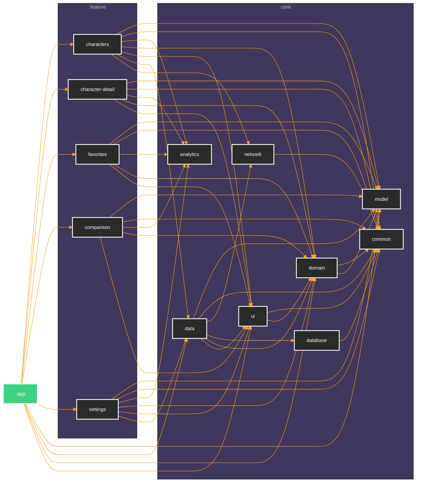

### Module Graph

```mermaid
%%{
  init: {
    'theme': 'base',
    'themeVariables': {"primaryTextColor":"#fff","primaryColor":"#5a4f7c","primaryBorderColor":"#5a4f7c","lineColor":"#f5a623","tertiaryColor":"#40375c","fontSize":"12px"}
  }
}%%

graph LR
  subgraph :core
    :core:model["model"]
    :core:common["common"]
    :core:analytics["analytics"]
    :core:domain["domain"]
    :core:ui["ui"]
    :core:database["database"]
    :core:network["network"]
    :core:data["data"]
  end
  subgraph :feature
    :feature:comparison["comparison"]
    :feature:characters["characters"]
    :feature:character-detail["character-detail"]
    :feature:favorites["favorites"]
    :feature:settings["settings"]
  end
  :feature:comparison --> :core:model
  :feature:comparison --> :core:common
  :feature:comparison --> :core:analytics
  :feature:comparison --> :core:domain
  :feature:comparison --> :core:ui
  :core:database --> :core:common
  :core:network --> :core:common
  :core:data --> :core:model
  :core:data --> :core:common
  :core:data --> :core:network
  :core:data --> :core:database
  :core:data --> :core:domain
  :core:data --> :core:ui
  :app --> :feature:characters
  :app --> :feature:character-detail
  :app --> :feature:favorites
  :app --> :feature:comparison
  :app --> :feature:settings
  :app --> :core:model
  :app --> :core:data
  :app --> :core:domain
  :app --> :core:ui
  :core:domain --> :core:common
  :core:domain --> :core:model
  :core:ui --> :core:common
  :core:ui --> :core:domain
  :feature:settings --> :core:model
  :feature:settings --> :core:common
  :feature:settings --> :core:analytics
  :feature:settings --> :core:domain
  :feature:settings --> :core:ui
  :feature:settings --> :core:data
  :feature:favorites --> :core:model
  :feature:favorites --> :core:common
  :feature:favorites --> :core:analytics
  :feature:favorites --> :core:domain
  :feature:favorites --> :core:ui
  :feature:character-detail --> :core:model
  :feature:character-detail --> :core:common
  :feature:character-detail --> :core:analytics
  :feature:character-detail --> :core:domain
  :feature:character-detail --> :core:ui
  :feature:characters --> :core:model
  :feature:characters --> :core:common
  :feature:characters --> :core:analytics
  :feature:characters --> :core:domain
  :feature:characters --> :core:ui
  :feature:characters --> :core:data
  :feature:characters --> :core:network

classDef android-library fill:#292B2B,stroke:#fff,stroke-width:2px,color:#fff;
classDef android-application fill:#3CD483,stroke:#fff,stroke-width:2px,color:#fff;
class :feature:comparison android-library
class :core:model android-library
class :core:common android-library
class :core:analytics android-library
class :core:domain android-library
class :core:ui android-library
class :core:database android-library
class :core:network android-library
class :core:data android-library
class :app android-application
class :feature:characters android-library
class :feature:character-detail android-library
class :feature:favorites android-library
class :feature:settings android-library

```