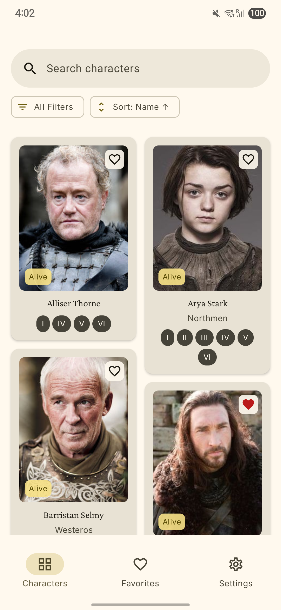
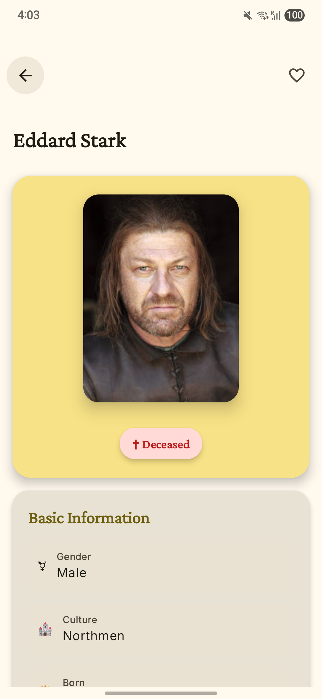
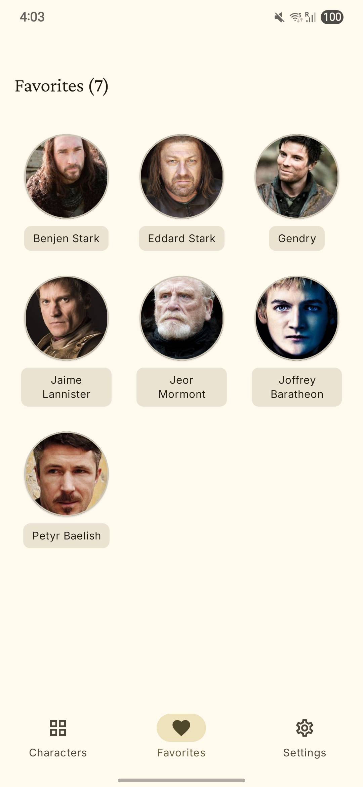
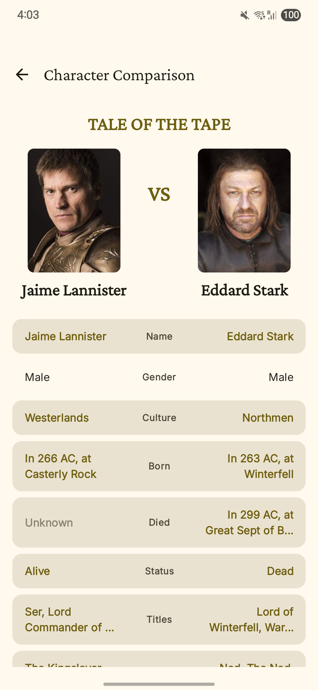
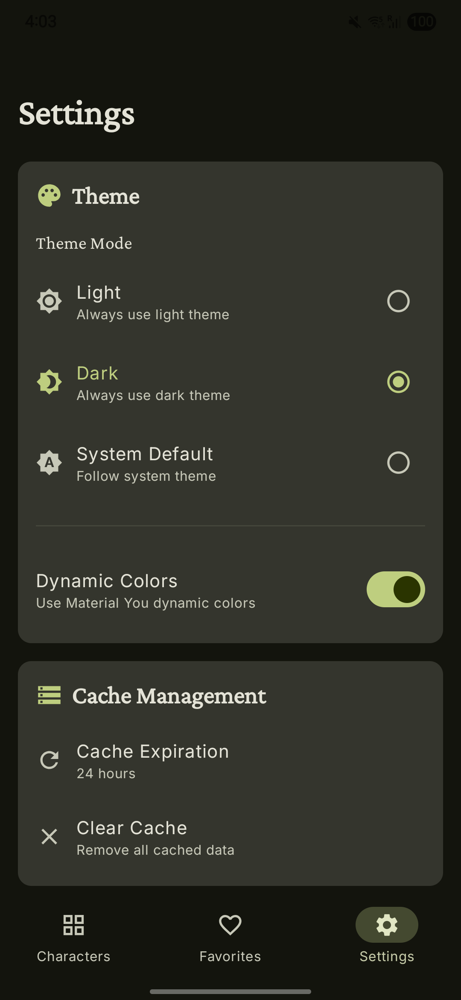
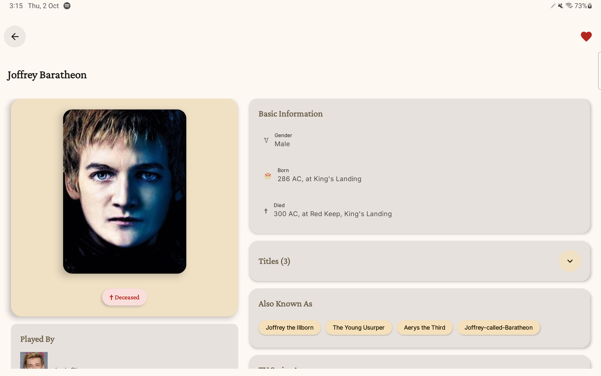
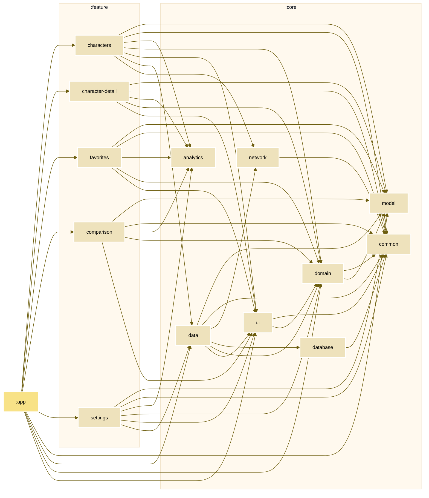

<div align="center">


# Game of Thrones App

**Modern Android showcase: MVI architecture, multi-module design, offline-first with Jetpack Compose**


</div>

---

## 📖 About

An Android app showcasing enterprise-level architecture and 2025 best practices. Features Game of Thrones character data with offline-first browsing, filtering, character comparison, and favourites management. All built with Clean Architecture, MVI pattern, and extensive testing coverage.

**Demonstrates:** Multi-module architecture, Konsist architectural testing, Firebase integration, Material 3 adaptive layouts, and comprehensive test coverage

---

## ✨ Key Features

**User Experience**

- Offline-first character browsing with Room caching and network sync
- Debounced search (300ms) with persistent history
- Multi-criteria filtering (status, culture, seasons) and flexible sorting
- Character comparison with side-by-side attribute breakdown
- Favourites management
- Firebase Analytics tracking
- Material 3 dynamic theming and dark mode support

**Technical Highlights**

- MVI pattern with unidirectional data flow
- Multi-module architecture (5 feature, 8 core modules)
- Offline-first with Room + Retrofit repository pattern
- Konsist architectural rules enforced
- Firebase Performance, Analytics, and Crashlytics
- Baseline Profiles for optimised startup
- Code quality: Detekt, Spotless, Kover coverage tracking

---

## 📱 Screenshots

<div align="center"> <table> <tr> <td><br/><strong>Search & Filter</strong></td> <td><br/><strong>Character Details</strong></td> <td><br/><strong>Favourites</strong></td> <td><br/><strong>Comparison</strong></td> <td><br/><strong>Settings</strong></td> </tr> </table> </div>

### Tablet Layout

<div align="center"> <table> <tr> <td><br/><strong>Search & Filter</strong></td> <td><br/><strong>Character Details</strong></td> </tr> </table> </div>

---

## 🏗️ Architecture

**MVI + Clean Architecture** with strict layer separation:

```
UI (Composables) → Intents
  ↓
ViewModel (StateFlow)
  ↓
UseCases (Domain Logic)
  ↓
Repository (Cache-first)
  ↓
Room ⟷ Retrofit
```

**Tech Stack**

- **Kotlin 2** with Coroutines, Flow, sealed classes
- **Jetpack Compose** - Declarative UI, zero XML
- **Room** - Offline-first reactive queries
- **Retrofit 3** + **OkHttp** - Type-safe API client
- **Hilt** - Compile-time dependency injection
- **Firebase** - Analytics, Crashlytics, Performance
- **Coil** - Image loading with Compose integration

**Testing & Quality**

- **44 test files**: Unit, integration, UI, and architectural tests
- **Konsist** - 22 architectural compliance rules
- **Detekt** + Compose rules - Static analysis
- **Spotless** + ktlint - Consistent formatting
- **Kover** - Code coverage tracking
- **Mockk, Turbine, Truth** - Robust test utilities

---

## 📂 Module Structure

```
app/                    # Application entry, WorkManager, Konsist tests
feature/                # Feature modules (presentation layer)
  ├── characters/       # List, search, filter
  ├── character-detail/ # Individual details
  ├── favorites/        # Favourites management
  ├── comparison/       # Character comparison
  └── settings/         # App preferences
core/                   # Shared modules
  ├── model/            # Domain models
  ├── domain/           # UseCases, repository interfaces
  ├── data/             # Repository implementations
  ├── database/         # Room DAOs and entities
  ├── network/          # Retrofit API
  ├── ui/               # Shared composables, theme
  ├── common/           # Utilities
  └── analytics/        # Firebase wrappers
```

**Why multi-module?**

- Parallel builds and Gradle caching reduce build times
- Clear boundaries prevent circular dependencies
- Features testable in isolation
- Konsist tests enforce layer separation

### Module Graph


## 🧪 Testing

```bash
./gradlew test                    # All unit tests
./gradlew connectedAndroidTest    # UI tests
./gradlew koverHtmlReport         # Coverage report
./gradlew detekt                  # Static analysis
./gradlew spotlessApply           # Format code
```

**Coverage:** Kover configured with exclusions for generated code (Hilt, Room)

**Konsist Rules Enforce:**

- Layer dependency constraints (no presentation in domain)
- Naming conventions (UseCase suffix in domain, ViewModel in features)
- MVI patterns (ViewModels expose StateFlow, not MutableStateFlow)
- UseCase single responsibility (operator invoke only)


---

## 👨‍💻 Developer

**Darach Ronayne** | Senior Android Developer @ LUSH

🔗 [LinkedIn](https://www.linkedin.com/in/darachronayne/) | 🐙 [GitHub](https://github.com/DRonayne) | 📧 [Email](mailto:darachronayne@gmail.com)

---
